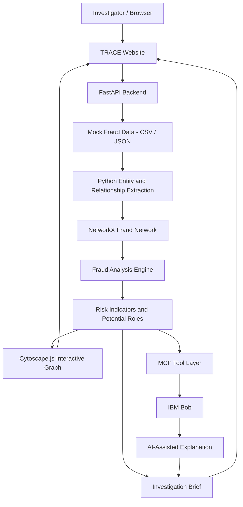

# Architecture

## System Architecture

TRACE is designed as an investigator-assistance system for analysing mock cyber-fraud intelligence.
The system ingests multiple forms of fraud-related data — such as transaction records, call logs, phone numbers, device identifiers, bank accounts and accused names — and converts them into a connected fraud network.

The architecture deliberately separates fact-based analysis from AI-assisted interpretation.

Python and NetworkX perform deterministic analysis such as connection counting, fund-flow tracing, shared-device detection and network centrality.

IBM Bob receives these findings through MCP tools and converts them into human-readable investigative explanations and structured case briefs.

The investigator remains the final decision-maker.

TRACE therefore follows the pipeline:

Data → Entities → Relationships → Network → Fraud Indicators → Potential Roles → Bob Analysis → Investigation Brief

## Components

| Component | Technology | Responsibility |
|---|---|---|
| Frontend | HTML, CSS, JavaScript | TRACE investigator dashboard, case viewing, entity inspection and user interaction |
| Graph Visualization | Cytoscape.js | Displays the interactive fraud network of accounts, people, devices and relationships |
| Backend API | FastAPI | Handles API requests and connects the frontend with analysis, graph and AI components |
| Data Processing | Python | Reads and normalizes mock fraud data from transaction records, call logs and related files |
| Entity & Relationship Extraction | Python | Identifies entities such as people, accounts, phones and devices and creates relationships between them |
| Network Analysis | NetworkX | Builds the fraud graph and calculates connections, paths and network metrics |
| Fraud Analysis Engine | Python Rule-Based Logic | Detects suspicious indicators such as rapid fund movement, shared devices and high connectivity |
| AI Assistant | IBM Bob | Explains investigation findings and assists in generating investigation summaries |
| AI Integration | Model Context Protocol (MCP) | Allows IBM Bob to interact with TRACE analysis tools and structured case data |
| Data Storage | CSV / JSON | Stores mock transaction, call, device, account and person data for the hackathon prototype |
| Report Generation | Python + IBM Bob | Generates the structured FIR-ready cyber-fraud investigation brief |

## Data Flow

## Data Flow

1. Mock cyber-fraud intelligence such as transaction records, call logs, device IDs, bank accounts, phone numbers and accused names is loaded into TRACE through CSV or JSON files.

2. The FastAPI backend sends the uploaded case data to the Python processing layer, where the records are cleaned, normalized and organized.

3. The system extracts important entities such as people, bank accounts, phone numbers and devices, and identifies relationships between them.

4. The extracted entities and relationships are converted into a fraud network using NetworkX, where each entity becomes a node and each relationship becomes an edge.

5. The Python fraud-analysis engine examines the network for suspicious indicators such as rapid fund movement, shared devices, multiple recipients, high connectivity and multi-hop transaction paths.

6. TRACE assigns explainable investigation indicators and potential roles such as victim, mule-like entity or potential central entity based on the detected patterns.

7. The processed graph and analysis results are returned through the FastAPI backend to the TRACE frontend.

8. Cytoscape.js displays the fraud network as an interactive graph, allowing investigators to select entities and inspect their connections, transactions and risk indicators.

9. When an investigator requests AI assistance, IBM Bob accesses approved TRACE investigation functions through the MCP tool layer and receives structured analysis data.

10. IBM Bob converts the analysis results into human-readable investigative explanations without replacing the underlying Python-based analysis.

11. TRACE combines the network findings, suspicious indicators, important relationships and AI-assisted analysis into a structured FIR-ready investigation brief.

12. The final investigation brief is displayed to the investigator through the TRACE dashboard for review and further investigation.

## Security Considerations

## Security Considerations

- TRACE currently uses **mock cyber-fraud data only**. No real banking, victim, telecom or police data is required for the hackathon prototype.

- Any API keys or credentials used for IBM Bob or related services should be stored in **environment variables** and excluded from GitHub using `.gitignore`.

- The current hackathon prototype does **not implement full user authentication, role-based access control or investigator account management**.

- CSV and JSON files are treated as demonstration inputs. Basic input validation should be performed before processing them, but the prototype is not designed to securely process untrusted production data.

- The MCP integration is intended to expose only specific TRACE investigation functions rather than unrestricted access to the application or underlying system.

- TRACE separates deterministic Python analysis from AI-generated explanations so that IBM Bob does not independently decide whether an entity is guilty or criminal.

- Risk levels and network roles are presented as **investigative indicators**, not legal conclusions. A human investigator is expected to review the underlying evidence.

- The current prototype does not implement enterprise features such as encrypted persistent storage, detailed audit logging, secrets management, database credential rotation or fine-grained access permissions.

- In a production deployment, TRACE would require stronger controls such as authentication, authorization, encrypted storage and transport, audit logs, secure secret management and strict case-level access controls.

## Scalability Notes

For a production-scale system:

- CSV/JSON storage could be replaced with a persistent database such as PostgreSQL for structured case data.
- Large fraud networks could be moved from in-memory NetworkX processing to a graph database such as Neo4j for faster relationship queries and larger datasets.
- The FastAPI backend could be deployed across multiple instances behind a load balancer once application state is moved out of local memory.
- Large graph-analysis jobs could be processed asynchronously using background workers and queues instead of blocking normal API requests.
- Transaction and telecom data could be ingested continuously rather than only through manually loaded files.
- Frequently requested entity and network results could be cached to reduce repeated graph calculations.
- IBM Bob/MCP requests could become a performance bottleneck when many investigators use the system simultaneously, so AI requests could be queued, rate-limited or cached where appropriate.
- The system could support multiple investigations at the same time by separating data and permissions by case.
- Production deployment would also require stronger authentication, audit logging, encrypted storage and case-level access controls.
